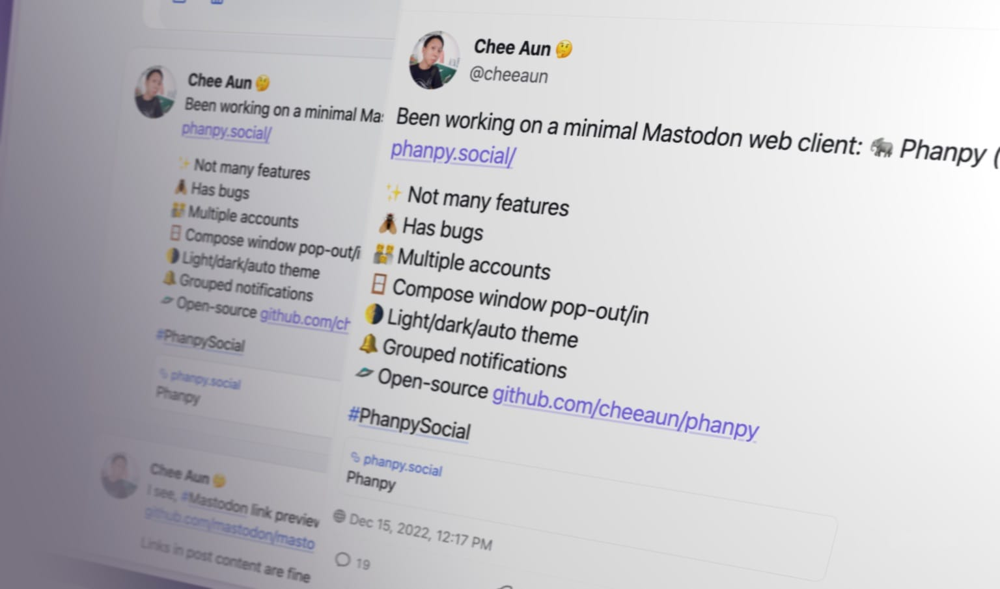
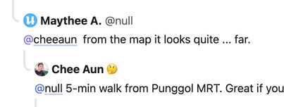
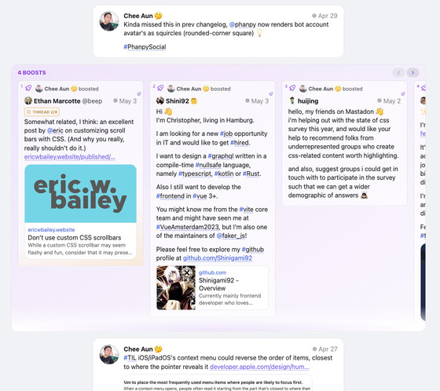

<div align="center">
  

Phanpy
===

**Minimalistic opinionated Mastodon web client.**
</div>



**🗣️ Pronunciation**: [`/fænpi/`](https://ythi.net/how-do-you-pronounce/phanpy/english/) ([`FAN-pee`](https://www.smogon.com/forums/threads/the-official-name-pronunciation-guide.3474941/)) [🔊 Listen](https://www.youtube.com/watch?v=DIUbWe-ysJI)

This is an alternative web client for [Mastodon](https://joinmastodon.org/).

- 🏢 **Production**: https://phanpy.social
  - `production` branch
  - break less often
  - slower fixes unless critical
- 🏗️ **Development**: https://dev.phanpy.social
  - `main` branch
  - may see new cool stuff sooner
  - may break more often
  - may be fixed much faster too

🐘 Follow [@phanpy on Mastodon](https://hachyderm.io/@phanpy) for updates ✨

Everything is designed and engineered following my taste and vision. This is a personal side project for me to learn about Mastodon and experiment with new UI/UX ideas.

## Features

- 👪 Multiple accounts
- 🪟 Compose window pop-out/in
- 🌗 Light/dark/auto theme
- 🔔 Grouped notifications
- 🪺 Nested comments thread
- 📬 Unsent draft recovery
- 🎠 Boosts Carousel™️
- ⚡ Shortcuts™️ with view modes like multi-column or tab bar
- #️⃣ Multi-hashtag timeline

## Design decisions

- **Status actions (reply, boost, favourite, bookmark, etc) are hidden by default**.<br>They only appear in individual status page. This is to reduce clutter and distraction. It may result in lower engagement, but we're not chasing numbers here.
- **Boost is represented with the rocket icon**.<br>The green double arrow icon (retweet for Twitter) doesn't look right for the term "boost". Green rocket looks weird, so I use purple.
- **Short usernames (`@username`) are displayed in timelines, instead of the full account username (`@username@instance`)**.<br>Despite the [guideline](https://docs.joinmastodon.org/api/guidelines/#username) mentioned that "Decentralization must be transparent to the user", I don't think we should shove it to the face every single time. There are also some [screen-reader-related accessibility concerns](https://twitter.com/lifeofablindgrl/status/1595864647554502656) with the full username, though this web app is unfortunately not accessible yet.
- **No autoplay for video/GIF/whatever in timeline**.<br>The timeline is already a huge mess with lots of people, brands, news and media trying to grab your attention. Let's not make it worse. (Current exception now would be animated emojis.)
- **Hash-based URLs**.<br>This web app is not meant to be a full-fledged replacement to Mastodon's existing front-end. There's no SEO, database, serverless or any long-running servers. I could be wrong one day.

## Subtle UI implementations

### User name display



- On the timeline, the user name is displayed as `[NAME] @[username]`.
- For the `@[username]`, always exclude the instance domain name.
- If the `[NAME]` *looks the same* as the `@[username]`, then the `@[username]` is excluded as well.

### Boosts Carousel



- From the fetched posts (e.g. 20 posts per fetch), if number of boosts are more than quarter of total posts or more than 3 consecutive boosts, boosts carousel UI will be triggered.
- If number of boosts are more than 3 quarters of total posts, boosts carousel UI will be slotted at the end of total posts fetched (per "page").
- Else, boosts carousel UI will be slotted in between the posts.

### Thread number badge (e.g. Thread 1/X)


- Check every post for `inReplyToId` from cache or additional API requests, until the root post is found.
- If root post is found, badge will show the index number of the post in the thread.
- Limit up to 3 API requests as the root post may be very old or the thread is super long.
- If index number couldn't be found, badge will fallback to showing `Thread` without the number.

### Hashtag stuffing collapsing


- First paragraph of post content with more than 3 hashtags will be collapsed to max 3 lines.
- Subsequent paragraphs after first paragraph with more than 3 hashtags will be collapsed to 1 line.
- Adjacent paragraphs with more than 1 hashtag after collapsed paragraphs will be collapsed to 1 line.
- If there are text around or between the hashtags, they will not be collapsed.
- Collapsed hashtags will be appended with `...` at the end.
- They are also slightly faded out to reduce visual noise.
- Opening the post view will reveal the hashtags uncollapsed.

### Filtered posts

- "Hide completely"-filtered posts will be hidden, with no UI to reveal it.
- "Hide with a warning"-filtered posts will be partially hidden, showing the filter name and author name.
  - Content can be partially revealed by hovering over the post, with tooltip showing the post text.
  - Clicking it will open the Post page.
  - Long-pressing or right-clicking it will "peek" the post with a bottom sheet UI.
  - On boosts carousel, they are sorted to the end of the carousel.

## Development

Prerequisites: Node.js 18+

- `npm install` - Install dependencies
- `npm run dev` - Start development server
- `npm run build` - Build for production
- `npm run preview` - Preview the production build
- `npm run fetch-instances` - Fetch instances list from [joinmastodon.org/servers](https://joinmastodon.org/servers), save it to `src/data/instances.json`
- `npm run sourcemap` - Run `source-map-explorer` on the production build

## Tech stack

- [Vite](https://vitejs.dev/) - Build tool
- [Preact](https://preactjs.com/) - UI library
- [Valtio](https://valtio.pmnd.rs/) - State management
- [React Router](https://reactrouter.com/) - Routing
- [masto.js](https://github.com/neet/masto.js/) - Mastodon API client
- [Iconify](https://iconify.design/) - Icon library
  - [MingCute icons](https://www.mingcute.com/)
- Vanilla CSS - _Yes, I'm old school._

Some of these may change in the future. The front-end world is ever-changing.

## Self-hosting

This is a **pure static web app**. You can host it anywhere you want.

Two ways (choose one):

### Easy way

Go to [Releases](https://github.com/cheeaun/phanpy/releases) and download the latest `phanpy-dist.zip` or `phanpy-dist.tar.gz`. It's pre-built so don't need to run any install/build commands. Extract it. Serve the folder of extracted files.

### Custom-build way

Requires [Node.js](https://nodejs.org/).

Download or `git clone` this repository. Use `production` branch for *stable* releases, `main` for *latest*. Build it by running `npm run build` (after `npm install`). Serve the `dist` folder.

Customization can be done by passing environment variables to the build command. Examples:

```bash
PHANPY_CLIENT_NAME="Phanpy Dev" \
    PHANPY_WEBSITE="https://dev.phanpy.social" \
    npm run build
```

```bash
PHANPY_DEFAULT_INSTANCE=hachyderm.io \
    PHANPY_DEFAULT_INSTANCE_REGISTRATION_URL=https://hachyderm.io/auth/sign_up \
    PHANPY_PRIVACY_POLICY_URL=https://hachyderm.io/privacy-policy \
    npm run build
```

It's also possible to set them in the `.env` file.

Available variables:

- `PHANPY_CLIENT_NAME` (optional, default: `Phanpy`) affects:
  - Web page title, shown in the browser window or tab title
  - App title, when installed as PWA, shown in the Home screen, macOS dock, Windows taskbar, etc
  - OpenGraph card title, when shared on social networks
  - Client name, when [registering the app for authentication](https://docs.joinmastodon.org/client/token/#app) and shown as client used on posts in some apps/clients
- `PHANPY_WEBSITE` (optional but recommended, default: `https://phanpy.social`) affects:
  - Canonical URL of the website
  - OpenGraph card URL, when shared on social networks
  - Root path for the OpenGraph card image
  - Client URL, when [registering the app for authentication](https://docs.joinmastodon.org/client/token/#app) and shown as client used on posts in some apps/clients
- `PHANPY_DEFAULT_INSTANCE` (optional, no defaults):
  - e.g. 'mastodon.social', without `https://`
  - Default instance for log-in
  - When logging in, the user will be redirected instantly to the instance's authentication page instead of having to manually type the instance URL and submit
- `PHANPY_DEFAULT_INSTANCE_REGISTRATION_URL` (optional, no defaults):
  - URL of the instance registration page
  - E.g. `https://mastodon.social/auth/sign_up`
- `PHANPY_PRIVACY_POLICY_URL` (optional, default to official instance's privacy policy):
  - URL of the privacy policy page
  - May specify the instance's own privacy policy
- `PHANPY_LINGVA_INSTANCES` (optional, space-separated list, default: `lingva.phanpy.social [...hard-coded list of fallback instances]`):
  - Specify a space-separated list of instances. First will be used as default before falling back to the subsequent instances. If there's only 1 instance, means no fallback.
  - May specify a self-hosted Lingva instance, powered by either [lingva-translate](https://github.com/thedaviddelta/lingva-translate) or [lingva-api](https://github.com/cheeaun/lingva-api)
  - List of fallback instances hard-coded in `/.env`
  - [↗️ List of lingva-translate instances](https://github.com/thedaviddelta/lingva-translate?tab=readme-ov-file#instances)

### Static site hosting

Try online search for "how to self-host static sites" as there are many ways to do it.

#### Lingva-translate or lingva-api hosting

See documentation for [lingva-translate](https://github.com/thedaviddelta/lingva-translate) or [lingva-api](https://github.com/cheeaun/lingva-api).

## Community deployments

These are self-hosted by other wonderful folks.

- [ferengi.one](https://m.ferengi.one/) by [@david@collantes.social](https://collantes.social/@david)
- [phanpy.blaede.family](https://phanpy.blaede.family/) by [@cassidy@blaede.family](https://mastodon.blaede.family/@cassidy)
- [phanpy.mstdn.mx](https://phanpy.mstdn.mx/) by [@maop@mstdn.mx](https://mstdn.mx/@maop)
- [phanpy.vmst.io](https://phanpy.vmst.io/) by [@vmstan@vmst.io](https://vmst.io/@vmstan)
- [phanpy.gotosocial.social](https://phanpy.gotosocial.social/) by [@admin@gotosocial.social](https://gotosocial.social/@admin)
- [phanpy.bauxite.tech](https://phanpy.bauxite.tech) by [@b4ux1t3@hachyderm.io](https://hachyderm.io/@b4ux1t3)
- [phanpy.hear-me.social](https://phanpy.hear-me.social) by [@admin@hear-me.social](https://hear-me.social/@admin)
- [phanpy.fulda.social](https://phanpy.fulda.social) by [@Ganneff@fulda.social](https://fulda.social/@Ganneff)
- [phanpy.crmbl.uk](https://phanpy.crmbl.uk) by [@snail@crmbl.uk](https://mstdn.crmbl.uk/@snail)

> Note: Add yours by creating a pull request.

## Costs

Costs involved in running and developing this web app:

- Domain name (.social): **USD$23.18/year** (USD$6.87 1st year)
- Hosting: Free
- Development, design, maintenance: "Free" (My precious time)

## Mascot

[Phanpy](https://bulbapedia.bulbagarden.net/wiki/Phanpy_(Pok%C3%A9mon)) is a Ground-type Pokémon.

## Maintainers + contributors

- [Chee Aun](https://github.com/cheeaun) ([Mastodon](https://mastodon.social/@cheeaun)) ([Twitter](https://twitter.com/cheeaun))

[](https://github.com/cheeaun/phanpy/graphs/contributors)

## Backstory

I am one of the earliest users of Twitter. Twitter was launched on [15 July 2006](https://en.wikipedia.org/wiki/Twitter). I joined on December 2006 and my [first tweet](https://twitter.com/cheeaun/status/1298723) was posted on 18 December 2006.

I know how early Twitter looks like. It was fun.

Back then, I [made a Twitter clone](https://twitter.com/cheeaun/status/789031599) called "Twig" written in Python and Google App Engine. I almost made my own [Twitter desktop client](https://github.com/cheeaun/chidori) written in Appcelerator Titanium. I [gave one of my best talks about the Twitter client](https://www.slideshare.net/cheeaun/story-of-a-thousand-birds) in a mini-conference. I built this thing called "Twitter [Columns](https://twitter.com/columns)", a web app that shows your list of followings, your followings' followings, your followers, your followers' followers and so on. In 2009, I wrote a blog post titled ["How I got started with Twitter"](https://cheeaun.com/blog/2009/04/how-i-got-started-with-twitter/). I created [two](https://twitter.com/cheeaun/status/1273422454) [themes](https://twitter.com/cheeaun/status/1487781343) for DestroyTwitter (a desktop client made with Adobe Air by Jonnie Hallman) and one of them is called ["Vimeo"](https://dribbble.com/shots/31624). In 2013, I wrote [my own tweets backup site](https://github.com/cheeaun/tweets) with a front-end to view my tweets and a [CouchDB backend](https://github.com/cheeaun/tweet-couch) to store them.

It's been **more than 15 years**.

And here I am. Building a Mastodon web client.

## Alternative web clients

- [Pinafore](https://pinafore.social/) ([retired](https://nolanlawson.com/2023/01/09/retiring-pinafore/)) - forks ↓
  - [Semaphore](https://semaphore.social/)
  - [Enafore](https://enafore.social/)
- [Cuckoo+](https://www.cuckoo.social/)
- [Sengi](https://nicolasconstant.github.io/sengi/)
- [Soapbox](https://fe.soapbox.pub/)
- [Elk](https://elk.zone/) - forks ↓
  - [elk.fedified.com](https://elk.fedified.com/)
- [Mastodeck](https://mastodeck.com/)
- [Trunks](https://trunks.social/)
- [Tooty](https://github.com/n1k0/tooty)
- [Litterbox](https://litterbox.koyu.space/)
- [Statuzer](https://statuzer.com/)
- [Tusked](https://tusked.app/)
- [Mastodon Glitch Edition (standalone frontend)](https://iceshrimp.dev/iceshrimp/masto-fe-standalone)
- [Mangane](https://github.com/BDX-town/Mangane)
- [More...](https://github.com/hueyy/awesome-mastodon/#clients)

## 💁‍♂️ Notice to all other social media client developers

Please, please copy the UI ideas and experiments from this app. I think some of them are pretty good and it would be great if more apps have them.

If you're not a developer, please tell your favourite social media client developers about this app and ask them to copy the UI ideas and experiments.

## License

[MIT](https://cheeaun.mit-license.org/).
